# Tone Atelier

사진 필터를 직접 제작하고, 공유·판매하는 SNS 커머스 앱

<p>
  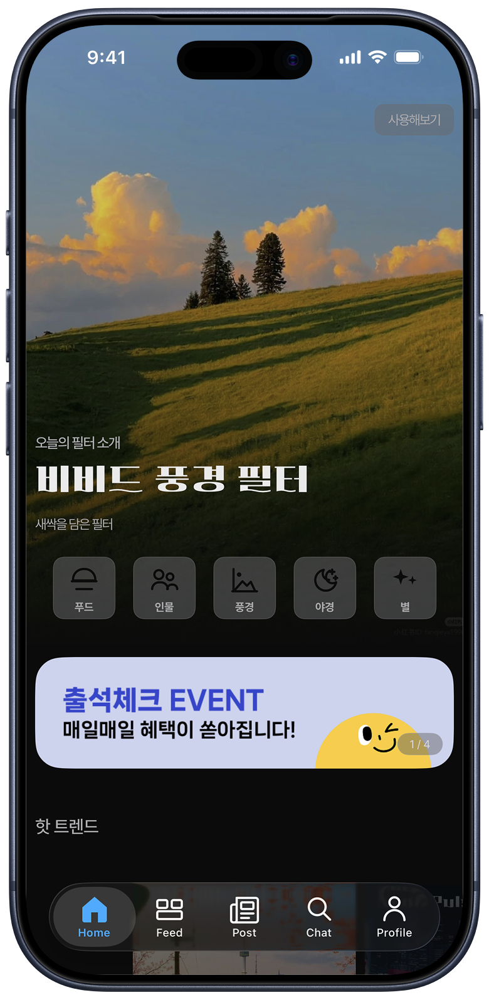
</p>

---

## 목차

- [소개](#소개)
- [기술스택](#기술스택)
- [핵심기능](#핵심기능)
  - [회원인증](#회원인증)
  - [카메라/필터](#카메라필터)
  - [채팅](#채팅)
  - [스트리밍](#스트리밍)
  - [결제](#결제)
  - [커뮤니티](#커뮤니티)
- [프로젝트 구조](#프로젝트-구조)
- [개발 환경](#개발-환경)
- [참고 사항](#참고-사항)

---

## 소개

- 기간
    - 초기 구현: 2026.04.22 ~ 2026.05.10
    - 업데이트: 2026.05.11 ~ 진행 중
- 팀구성
    - iOS 개발 - 1인
    - Backend 개발 - 1인
    - 디자인 - AI 플랫폼 활용 (figma / pencil)
- 지원 플랫폼
    - iPhone
- 최소 지원버전
    - iOS 18.0

---

## 기술스택

### UI 및 아키텍처

- SwiftUI
- TCA (The Composable Architecture)
- Swift Concurrency

### 데이터 및 네트워크

- URLSession, Alamofire, SocketIO
- SwiftData, UserDefaults, Keychain
- UserNotifications, Firebase (Core, Messaging)

### 인증 및 비즈니스 로직

- AuthenticationServices (Apple)
- KakaoSDK (Auth, Common)
- iamport_ios
- WebKit

### 미디어

- AVFoundation, AVKit
- PhotosUI, ImageIO, CoreImage, CoreGraphics, MetalKit
- CoreLocation, MapKit

### 로그, 테스트 및 컨벤션

- OSLog
- XCTest
- SwiftLint

---

## 핵심기능

### 회원인증

<p>
  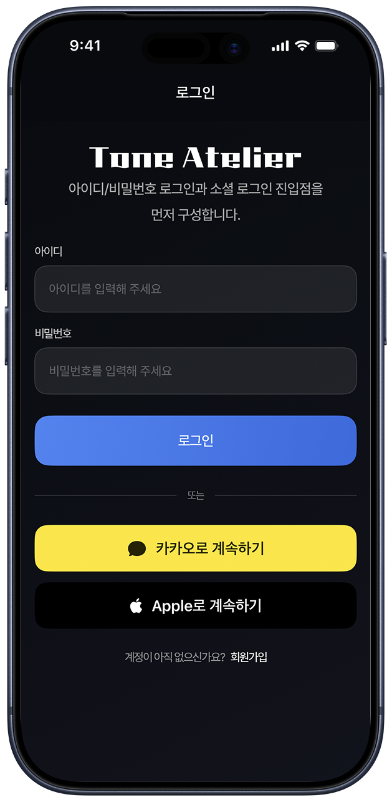
</p>

- 기능
    - 회원가입
    - 이메일 로그인 기능
    - 소셜 로그인 기능
        - 카카오 로그인
        - 애플 로그인
    - 프로필 편집 (닉네임 / 소개 / 프로필 이미지)
    - 알림 / 환경 설정, 앱 정보
- 사용기술
    - JWT, RTR, Keychain
- 고려사항
    - 액세스 토큰 / 리프레시 토큰 만료 시 RTR 방식 토큰 갱신 처리
    - 로그아웃 시 저장소 데이터 처리
        - 삭제 vs 계정 ID 기반 분리
        - RTR로 인해 1200분 이후 로그아웃 시 전체 데이터 삭제 여부
        - 로그아웃 직후 동일 계정 재로그인 시 데이터 삭제 여부

### 카메라/필터

<p>
  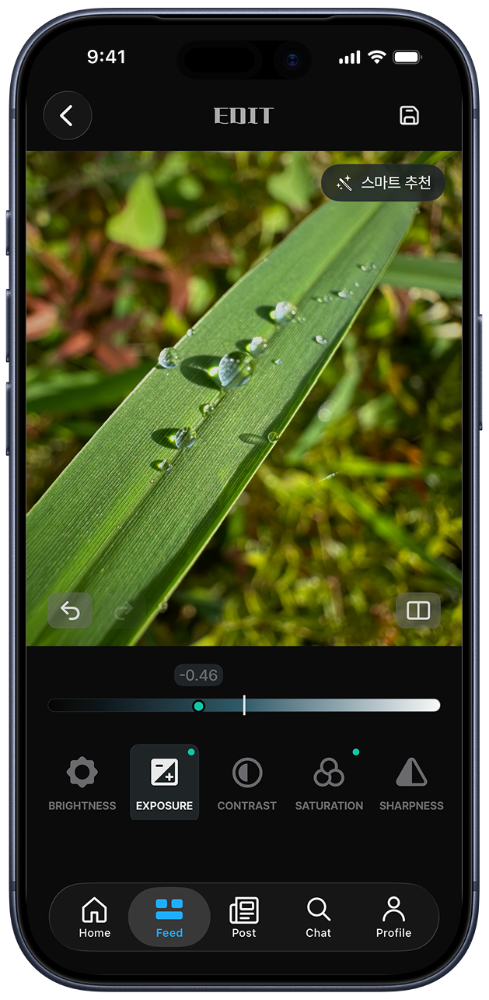
  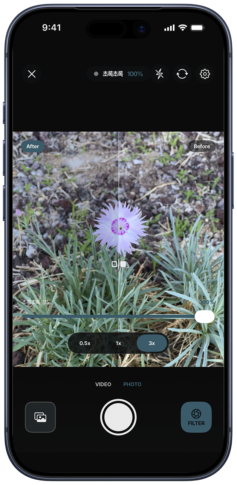
  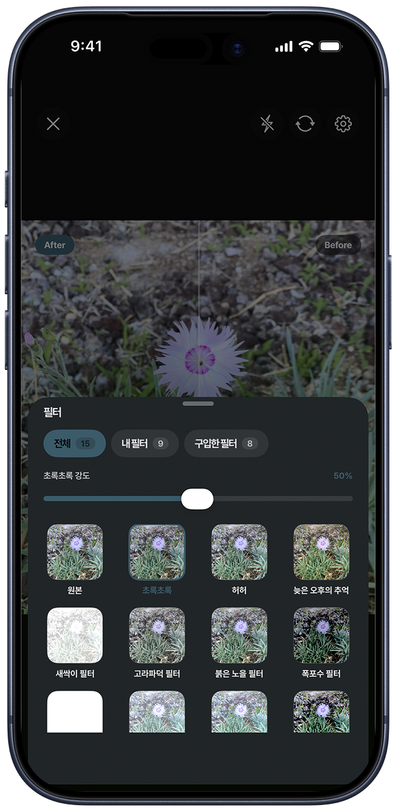
</p>

- 기능
    - 카메라를 통한 필터 적용 사진 촬영 기능
    - 카메라를 통한 필터 적용 동영상 녹화 기능
    - 기존 촬영 사진에 필터 적용
    - 실시간 필터 라이브뷰
    - 필터 편집 / 저장 (값 조정, 프리셋 관리)
    - EXIF 기반 카메라 정보 추출 (GPS, ISO, 셔터 스피드 등)
- 사용기술
    - CIFilter, CGImage, MTKView
- 고려사항
    - 렌더링 최적화
        - 필터 프리뷰 그리드 displayScale 기반 다운샘플링
        - LazyVGrid 로 화면 밖 셀 렌더링 차단
        - 선택 셀 한정 재렌더링으로 다중 셀 GPU 부하 최소화

### 채팅

<p>
  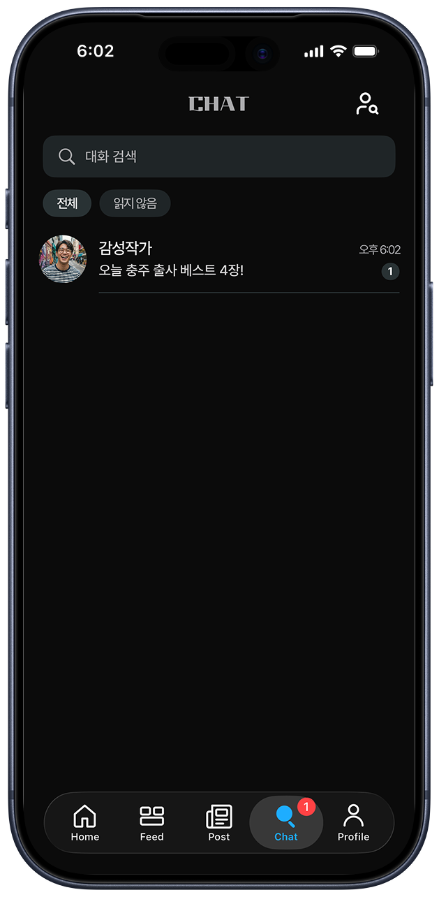
  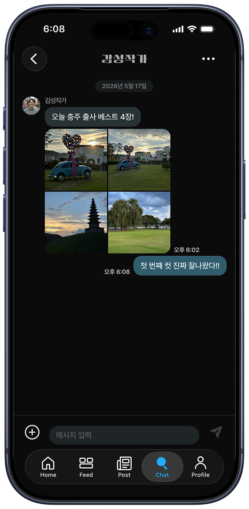
</p>

- 기능
    - 실시간 1:1 채팅 기능
    - 채팅방 내 파일 업로드 및 뷰어 기능
    - push 알림 기능
    - 모바일 Local DB (SwiftData) 기반 데이터 영속화
- 사용기술
    - SocketIO, UserNotifications, Firebase (Core, Messaging)
- 고려사항
    - 채팅 구현 네트워크 방식 선택 (Socket vs HTTP)
    - 채팅 Flow 설계 (DB + Socket + HTTP + Push)
        - ChatList 갱신 방법
        - 네트워크 단절 / 악화 시 처리
        - Socket과 HTTP 중복 메시지 방어로직 작성
    - 작성 중 뒤로가기 시 임시저장 처리 및 보관 기간

### 스트리밍

<p>
  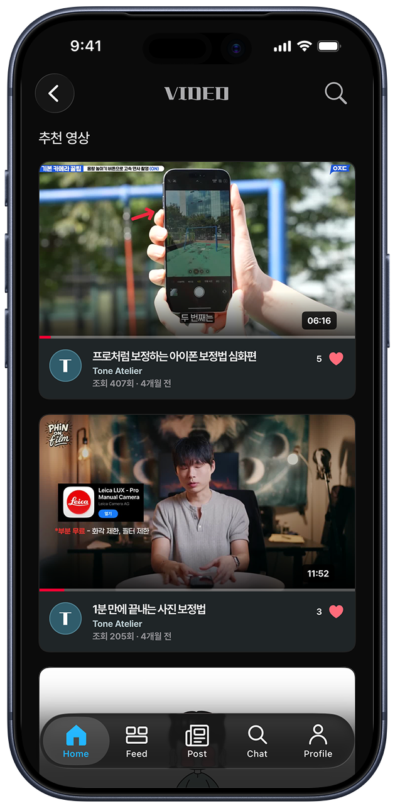
  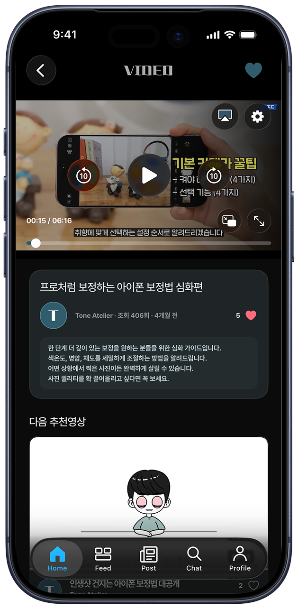
  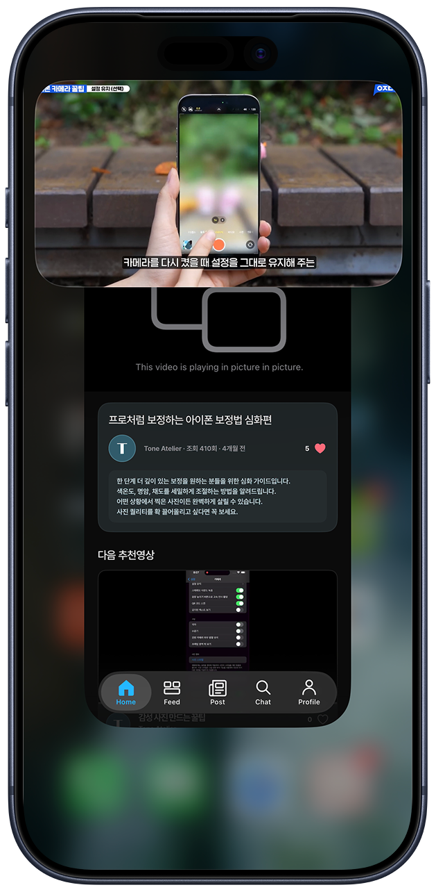
</p>

- 기능
    - 영상 스트리밍 기능
        - 시청 진행도 및 이어보기 기능
    - 화질 / 다국어 커스텀 자막 / 배속 선택 기능
    - 네트워크 대역 환경에 따른 동적 해상도 지원 (ABR)
    - PIP 기능
- 사용기술
    - URL Token 기반 HLS 접근제어
    - AVFoundation (AVPlayer, AVPlayerLayer), AVKit
- 고려사항
    - 영상 재생 중 백그라운드 전환 처리
    - 영상 재생 중 토큰 만료 시 처리

### 결제

<p>
  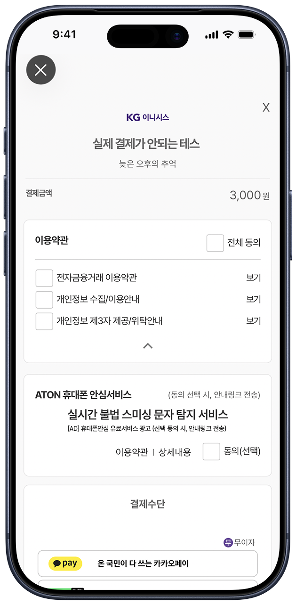
  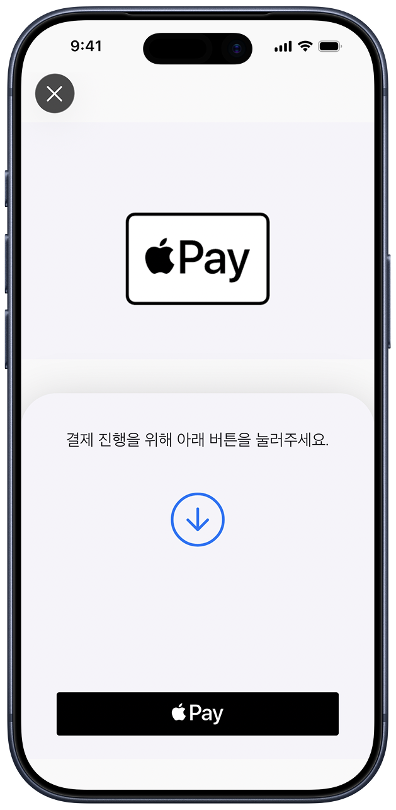
</p>

- 기능
    - PG (Payment Gateway) 기반 인앱결제 기능 구현
        - 네트워크 단절에 따른 결제 정합성 보장을 위한 예외처리 로직 구현
    - 영수증 검증 API를 통한 트랜잭션ID 검증
    - 크리에이터 스토어 (필터 상품 목록 / 상세)
    - 구매 내역 조회
- 고려사항
    - 네트워크 단절 / 악화 / 서버 오류로 결제 후 검증 실패 시 처리

### 커뮤니티

<p>
  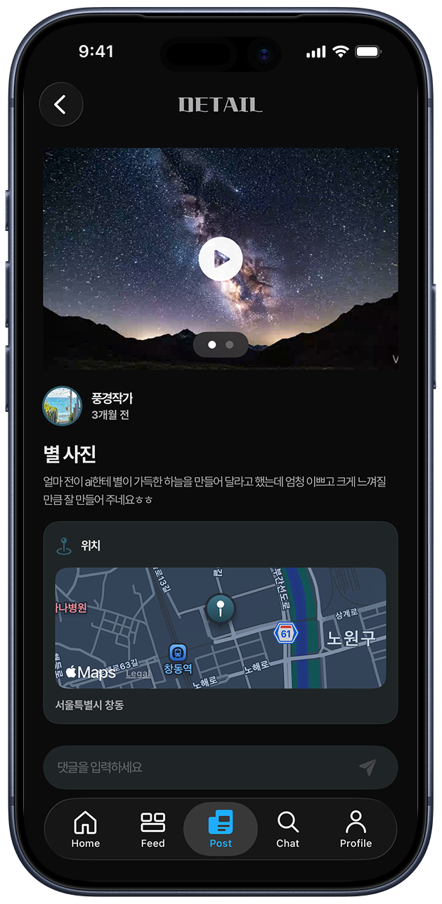
</p>

- 기능
    - 게시판 (게시글 생성, 편집, 삭제, 좋아요, 댓글, 대댓글)
    - 게시글 위치 첨부 (지도 기반 위치 선택, 최근 위치 캐시)
    - 게시글 / 사용자 검색 및 사용자 프로필 조회
    - 좋아요한 게시글 / 필터 모음
    - 파일 업로드 (사진 및 영상파일 지원)
    - 영상 파일 스트리밍
        - HTTP Range Header를 이용한 바이트 오프셋 기반의 부분 데이터 스트리밍
    - 홈 배너 및 상품 상세
- 사용기술
    - Cursor Pagination
    - multipart/form-data
    - HTTP + Range (progressive streaming)
    - AVAssetExportSession
    - CoreLocation, MapKit
- 고려사항
    - 파일 업로드
        - 이미지 5MB 초과 시 ImageIO 기반 리사이즈
        - 비디오 5MB 초과 시 트랜스코딩
        - 파일 헤더로 실제 형식 판별, JPEG / PNG / HEIC 외 포맷은 색재현 손실 우려로 업로드 거부
        - 커뮤니티 게시물 이미지 단변 320px 미만 안내 문구
    - ETag 기반 메모리 캐시 (최대 50MB) + LRU 교체 정책
    - 공백 / 동일 단어 검색 시 서버 호출 예외 처리
    - 화면별 좋아요 동기화 처리
    - 좋아요 기능에 Optimistic UI 적용, 실패 시 이전 상태 롤백 및 Toast 알림 처리
    - 게시글 조회 시 텍스트 우선 표시 후 이미지 / 썸네일 후속 렌더링

---

## 프로젝트 구조

```
ToneAtelier/
  App/Root/             앱 진입점 (AppRootFeature/View, AppURLScheme)
  Features/
    Auth/{Login, Join}/
    MainTab/
    Tabs/
      Home/             배너, 상품 상세
      Feed/             필터 피드
      Post/             게시글 (Detail, Write, Search, Liked, Location, UserPosts)
      Chat/             List, Room, Search, Socket, Storage
      Profile/          Edit, CreatorStore, LikedFilters, Preference
      Make/             필터 제작 (Edit)
      Video/            영상 (Detail, Storage)
    UserProfile/        타 사용자 프로필
  Shared/
    DesignSystem/       AppTheme, AppAsset, Fonts
    Components/         공용 UI 컴포넌트
    Extensions/         Foundation / SwiftUI 확장
  Networking/
    HTTPClient.swift    단일 진입점 (send + token refresh + session invalidation)
    URLRequestBuilder.swift
    Routers/            APIRouter enum (도메인별)
    Models/             공용 네트워킹 타입 + DTO
    Support/            Logger+App, URLQueryItem+Helpers
  Dependencies/         TCA Dependency Client (XxxClient.swift)
  Debug/                디버그 메뉴 (#if DEBUG)
ToneAtelierTests/
ToneAtelierUITests/
```

---

## 개발 환경

- Xcode 26.3
- Swift 5
- Swift Package Manager
- SwiftLint

---

## 참고 사항

이 저장소는 외부에서 clone 받아 바로 빌드하거나 실행하기는 어렵습니다.

- `APIInfo.swift`, `Configs/Secrets.xcconfig`, `GoogleService-Info.plist` 는 git 에 올리지 않은 개인 발급 파일입니다
